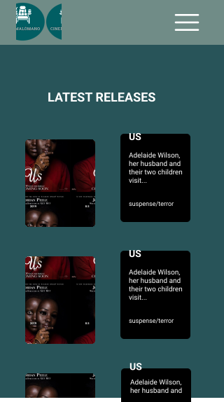
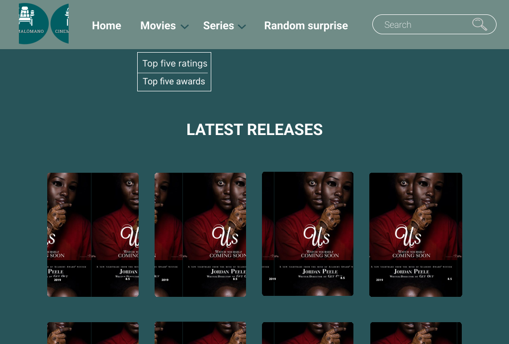

# Cinemalómano

## Índice

- [1. Preámbulo](#1-preambulo)
- [2. Resumen del proyecto](#2-resumen-del-proyecto)
- [3. Consideraciones generales](#3-consideraciones-generales)
- [4. Consideraciones finales](#4-consideraciones-tecnicas)

---

## 1. Preámbulo

La manera en que vemos películas ha cambiado radicalmente durante los últimos
años debido, en parte, a la aparición de los servicios de
[_streaming_](https://es.wikipedia.org/wiki/Streaming) que nos permiten hacerlo
desde donde estemos y en cualquier momento. El mejor reflejo de este fenómeno es
el éxito de Netflix, HBO y Disney+, etc.

En tiempos en los que una de las principales herramientas para combatir
[la pandemia de Covid-19](https://es.wikipedia.org/wiki/COVID-19) es [evitar](https://es.wikipedia.org/wiki/Distanciamiento_social) compartir
espacios con muchas personas (como en el cine), ver películas por _streaming_
será una de las pocas maneras de hacerlo (¿o la única?).

Vimos la gran oportunidad de proponer experiencias innovadoras utilizando películas y series, donde el usuario va a poder expermimentar distintas emociones.

## 2. Resumen del proyecto

La idea de este proyecto fue usar una API con información de películas, en donde el usuario tuviera experiencias únicas con ellas, dividida en secciones, tales como:

🏆 Ver las películas más premiadas.

👀 Ver películas o series más vistas y que más han gustado al público.

⚡ Ver todas las series relacionadas a las mujeres.

🎁 Una caja sorpresa donde no tendrás que decidir, qué ver el fin de semana, nosotros lo hacemos por ustedes. 

Entre otras...

## 3. Consideraciones generales

- Este proyecto diseñó y desarrolló centrado en el usuario. Para esto se hizo prototipos de alta fidelidad e historias de usuario, donde se realizaron test de usabilidad y se iteró sobre el feedback recibido, para mejorar la experiencia de usuario:

          

## 4. Consideraciones finales

- Para empezar a vivir esta gran aventura ingresa a [cinemalomano](https://cinemalomano.netlify.app) 🎬  
